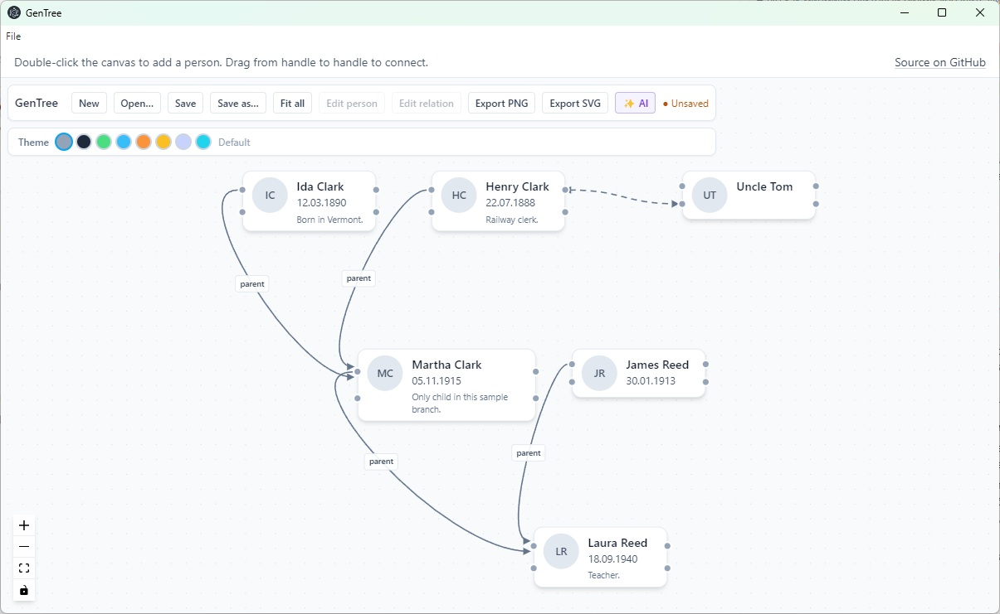

# GenTree

Local **genealogy-style graph** editor for desktop (Electron). Sketch people and relationships quickly: add nodes, connect them, snap rows, then export **PNG** or **SVG**. Data lives in a plain **JSON** project file (`.gentree.json`).

Built-in **AI assistant** (OpenAI) can generate or extend the graph from a plain-text description — just describe your family in your own words.



**SEO / discoverability:** GenTree is a **simple tool for drawing genealogy trees** on the desktop—quick pedigree and family-tree sketches without a heavy genealogy database. Add people, **ancestor–descendant** links, and labels; export to PNG/SVG. Use it as a **lightweight genealogy graph editor** for kinship diagrams.

**Keywords:** simple genealogy tree drawing tool, family tree drawing software, pedigree chart editor, local offline family tree, kinship diagram, ancestor descendant graph, family tree program, genealogy diagram editor, free open source MIT.

**License:** [MIT](LICENSE).

**Try online:** the static web build is at [zeebra.top/gen-tree](https://zeebra.top/gen-tree). Open/Save/Export use the browser's file picker where supported (Chromium); otherwise files are chosen or downloaded via a regular dialog.

## How to run (prebuilt)

Prebuilt binaries are published on [**GitHub Releases**](https://github.com/alagishev/GenTree/releases/latest) (that link always points at the latest release).

1. On the release page, under **Assets**, download the file for your OS:
   - **Windows:** `GenTree-Setup-*.exe` (installer) or `GenTree-*-portable.exe` (portable copy, no install).
   - **Linux:** `GenTree-*-Linux.AppImage`.
2. Run it:
   - **Windows:** open the downloaded `.exe`. Code signing is not configured—SmartScreen may warn on first run; if needed choose **More info** → **Run anyway**.
   - **Linux:** make the AppImage executable (`chmod +x GenTree-*-Linux.AppImage`) and run it; AppImage may require FUSE (see your distro's notes).

For development from source, see [Run from source](#run-from-source) below.

## Why it exists

Full genealogy suites are often heavy; generic diagram tools are flexible but not tuned for quick family trees. GenTree targets **fast prototyping**: capture everyone you know, then rearrange and label the graph without fighting the tool.

So, I've decided to generate a tool for my own. It was an experiment — how easy is it to create a very special tool for my own short-living requirements instead of using existing heavy tools or a more generic tool like draw.io. This repo is an answer. It took 0.5md.

The workflow is **similar to draw.io desktop** (local files, File menu, image export), but the **file format is GenTree's own JSON**, not draw.io XML. See [docs/analogs-and-scope.md](docs/analogs-and-scope.md).

## Features

### Graph editing
- **Double-click** empty canvas — new person (Y snaps to rows).
- **Connect** via handles on node sides; **double-click** a person or edge to edit.
- **Right-click** node or edge — context menu (edit / delete).
- **Ctrl+Z** — undo graph edits (when focus is not in an input).
- **File** — New, Open, Save, Save As; **Export PNG** / **Export SVG** (export fits all nodes in frame briefly, then restores the view).

### Color themes

Eight built-in visual themes selectable from the toolbar: **Default, Dark, Forest, Ocean, Sunset, Vintage, Minimal, Neon**. Themes change the canvas background, node colors, edge colors, and background pattern in one click — no restart required.

### ✨ AI Assistant

Click the **✨ AI** button in the toolbar to open the AI assistant panel.

Describe your family in plain language — the AI will extract people, birth years, and relationships and draw the graph automatically:

> *"I'm John, my mother is Mary, my father is George. My brother Peter was born in 1985. My paternal grandmother is Vasilisa; she had a brother Evstafiy who was married to Matrona."*

**Two modes:**
- **Create new graph** — replaces the current canvas with an AI-generated tree.
- **Add to existing graph** — sends the current graph as context and merges new people and edges into it; Ctrl+Z undoes the result.

An **OpenAI API key** is required (`sk-...`). The key is used only for the current request and is **never stored** — not in memory between sessions, not on disk.

The assistant uses **GPT-4o** and positions nodes by generation: grandparents at the top, the main subject in the middle, children below.

## Documentation

| | |
|--|--|
| [Documentation index](docs/README.md) | All English guides |
| [Vision](docs/vision-and-motivation.md) | Goals and motivation |
| [Architecture](docs/architecture.md) | Stack and main code paths |
| [File format](docs/file-format.md) | `.gentree.json` schema |
| [AI / Cursor](docs/ai-development.md) | Agent playbook and repo guide |
| [Roadmap](docs/roadmap.md) | Planned features |
| [Sample tree](docs/samples/README.md) | Example graph + how to open it |

## Requirements

- **Node.js** ≥ 18 (CI uses 22)

## Run from source

```bash
npm install
npm run dev
```

Dev uses Vite (default port **5318**, see `vite.config.ts` and `GENTREE_DEV_PORT`). If the port is busy, Vite picks the next free port and passes it to Electron via `scripts/run-dev.cjs`.

## Build

```bash
npm run build
```

Outputs: renderer in `dist/`, Electron bundles in `dist-electron/`.

**Static site only** (e.g. nginx): use `npm run build:web` so Cloudflare Web Analytics is injected into `dist/index.html`. Set `VITE_CF_BEACON_TOKEN` to your beacon token (env or `.env.production.local`). Plain `npm run build` does **not** set `VITE_CF_WEB`, so Electron builds stay without the analytics script.

### Windows (NSIS + portable)

```bash
npm run dist:win
```

Artifacts under `release/`: installer `GenTree-Setup-x.x.x.exe` and `GenTree-x.x.x-portable.exe`. Code signing is not configured; SmartScreen may prompt on first run.

### Linux (AppImage)

```bash
npm run dist:linux
```

Artifact: `release/GenTree-x.x.x-Linux.AppImage`.

### All targets (current OS)

```bash
npm run dist
```

### GitHub Releases

Pushing a tag `v*` (e.g. `v0.1.0`) triggers [`.github/workflows/release.yml`](.github/workflows/release.yml): Windows `.exe` artifacts and Linux `.AppImage` are attached to a GitHub Release. Align `package.json` `version` with the tag (without the `v` prefix).

## Contributing / AI forks

The repo includes a sequenced agent task list under `docs/agent-tasks/` and [docs/CURSOR_REPO_GUIDE.md](docs/CURSOR_REPO_GUIDE.md) for structural edits. Fork and adapt freely under the MIT license.
