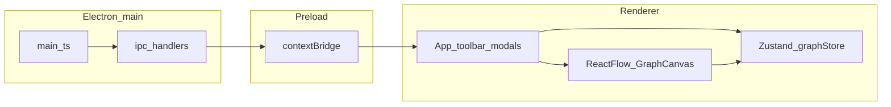

# Architecture

GenTree is an **Electron** application: a **Node-capable main process** owns native dialogs and filesystem access; a **Chromium renderer** runs the UI. They communicate through **IPC** exposed to the page via a **preload script** and `contextBridge` (no `nodeIntegration` in the renderer).

## Stack

| Layer | Technology |
|-------|------------|
| Desktop shell | Electron |
| Renderer UI | React 18, TypeScript |
| Bundler (renderer) | Vite |
| Graph canvas | React Flow (`@xyflow/react`) |
| Client state | Zustand |
| Styling | Tailwind CSS |
| PNG capture | `html-to-image` |

## High-level flow

## Important paths

- **`electron/main.ts`** — window, application menu, `ipcMain.handle` for open/save/export.
- **`electron/preload.ts`** — exposes `window.gentreeFiles` and `window.gentreeMenu` to the renderer.
- **`src/App.tsx`** — top-level layout, menu subscription, wiring.
- **`src/store/graphStore.ts`** — canonical graph state (nodes, edges, viewport, dirty flag, undo).
- **`src/components/GraphCanvas.tsx`** — React Flow host, interaction handlers.
- **`src/components/PersonNode.tsx`**, **`RelationEdge.tsx`** — custom node and edge types.
- **`src/lib/gentreeFile.ts`** — parse/serialize **`.gentree.json`**.
- **`src/hooks/useProjectFileActions.ts`** — connects store + React Flow to IPC for file I/O and PNG/SVG export.

## Development vs production

In development, `scripts/run-dev.cjs` starts Vite and Electron; the window loads the dev server URL (`GENTREE_DEV_URL` / `GENTREE_DEV_PORT`). In production, the window loads `dist/index.html` after `vite build` and `esbuild` bundles for `dist-electron/`.
